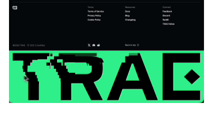
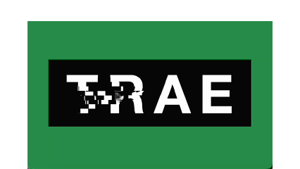

# signal-glitch · Trae 风格像素故障鼠标互动

一个用**纯 HTML + Canvas** 模仿 [Trae](https://www.trae.ai/) 官网像素溶解/位移互动效果的小 Demo。

> 灵感来自 Trae 官网的鼠标互动（原版做得更好），这是一次 Vibe Coding 模仿练习，仅作效果复现与分享。

## 效果对比

左边是 [Trae 官网](https://www.trae.ai/) 原版页脚互动，右边是我的纯 HTML + Canvas 复刻版：

| 原版 (Trae 官网) | 复刻版 (本 Demo) |
| --- | --- |
|  |  |

> 差异说明：原版是完整品牌官网 footer，错位更强烈、字体更大、右侧带菱形装饰；复刻版只保留核心"文字像素随鼠标速度错位"的互动，单文件零依赖，可自行改文字和配色。

## 在线演示

👉 **https://SeanYang24.github.io/signal-glitch/**

把鼠标在画面上移动，像素块会随鼠标位移产生错位、溶解的故障感效果。

## 本地运行

零依赖、零构建，任选一种方式：

- **最简单**：直接双击 `index.html` 用浏览器打开即可。
- 本地起服务（可选）：
  ```bash
  npx serve
  # 或
  python3 -m http.server 8000
  ```

## 自定义

所有可改项都集中在 `index.html` 顶部的 `CONFIG` 配置块里，改完刷新即可，无需任何构建：

| 想改什么 | 改 `CONFIG` 里的字段 |
| --- | --- |
| 显示的文字 | `text`（如 `'TRAE'` → `'你的频道名'`） |
| 页面 & 遮罩背景色 | `bgColor`（默认 Trae 绿 `#2a8c4a`） |
| 文字区域底色 | `blockBgColor`（默认 `#0a0a0a`） |
| 文字颜色 | `textColor`（默认 `#ffffff`） |
| 像素网格密度 | `cols` / `rows`（默认 20 / 15，越大越细碎） |
| 鼠标错位强度 | `layers` 里的 `moveXr / moveXl / moveYu / moveYd` |

> 提示：文字过长可能超出文字区域宽度，建议 4~6 个字效果最佳。

## 文件说明

- `index.html` — 唯一文件，包含全部 HTML / CSS / JS，顶部 `CONFIG` 块为所有自定义入口，无任何外部依赖（不联网、不引库、不用构建）。

## License

MIT —— 拿去玩、改、二次创作都行，署名就更好了 🙂
